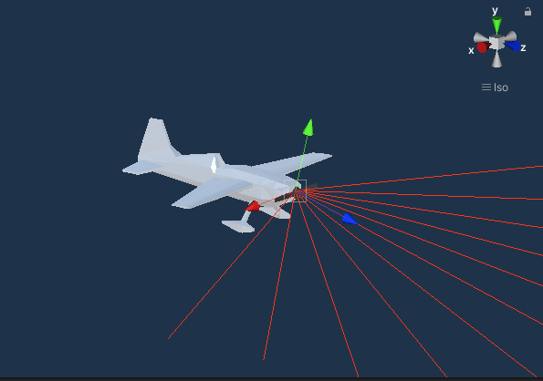
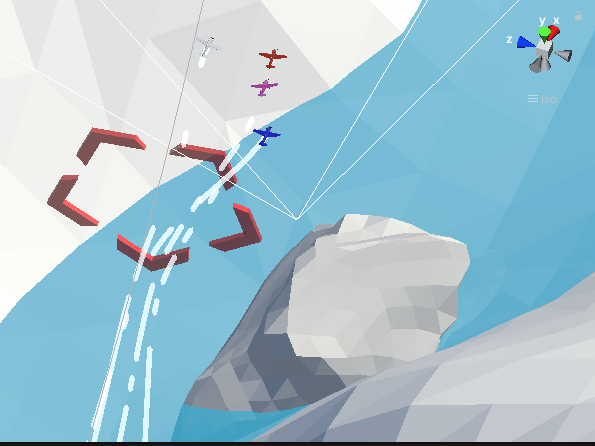

# AI Airplane
## Multi Agent Reinforcement Learning with Unity and MLAgents

based on the Udemy course [Reinforcement Learning: AI Flight with Unity ML-Agents](https://www.udemy.com/course/ai-flight/)

### Requirements
- Unity 2020.1.10f1
- ML Agents Version 1.4.0-preview - September 21, 2020 (within Unity)
- mlagents 0.21.0 (within python)
- python 3.8.5

### Agent
- 3 ray sensors with 5 beams per direction
- 3 different models
   - Normal 
   - Snow Hard
   - Desert Hard

### Environment
-  2 areas + 2 training areas
   - training areas don't have a normal player
   - environment is multiplied 4x for faster training
   - environment contains ground, stones and water with mesh collider

### Learning
- Learning config can be found in config/trainer_config.yaml
- algorithm: [PPO (Proximal Policy Gradient)](https://openai.com/blog/openai-baselines-ppo/)
- modified to work with mlagents 0.21 for python 3.8
- curricula with four lessons
